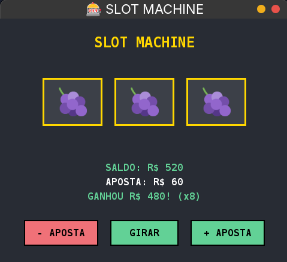

# 🎰 Pixel Slot Machine

Um jogo de caça-níquel desenvolvido em Java com interface gráfica estilo pixel art.


## 📸 Screenshots

<div align="center">

</div>
## 🎮 Sobre o Projeto

Este projeto é uma evolução de uma slot machine console para uma versão com interface gráfica completa. O jogo apresenta visual pixel art, animações suaves e mecânicas de jogo balanceadas.

### ✨ Características

- **Visual Pixel Art**: Interface escura com elementos dourados e verdes
- **Sprites Reais**: Emojis do Twemoji como símbolos das frutas
- **Animações**: Reels giram com efeito visual durante o spin
- **Sistema de Apostas**: Controle de aposta com validações
- **Feedback Visual**: Mensagens coloridas e states dos botões
- **Arquitetura MVC**: Código organizado e manutenível

## 🛠️ Tecnologias Utilizadas

- **Java 17**: Linguagem principal
- **Java Swing**: Interface gráfica
- **Maven**: Gerenciamento de dependências e build
- **Twemoji**: Sprites dos símbolos (PNG)

## 🚀 Como Executar

### Pré-requisitos
- Java 17 ou superior
- Maven 3.6+

### Instalação

1. Clone o repositório:
```bash
git clone https://github.com/seu-usuario/slot-machine-gui.git
cd slot-machine-gui
```

2. Compile o projeto:
```bash
mvn clean compile
```

3. Execute o jogo:
```bash
mvn exec:java -Dexec.mainClass="com.slotmachine.Main"
```

### Alternativa (IDE)
1. Importe o projeto no IntelliJ IDEA ou Eclipse
2. Execute a classe `Main.java`

## 🎯 Como Jogar

1. **Ajustar Aposta**: Use os botões `- APOSTA` e `+ APOSTA`
2. **Girar**: Clique em `🎰 GIRAR 🎰`
3. **Objetivo**: Conseguir 3 símbolos iguais para ganhar
4. **Multiplicadores**: Cada símbolo tem um valor diferente

### 💰 Tabela de Pagamentos

| Símbolo | Multiplicador |
|---------|---------------|
| 🍇 Uva | x8 |
| 🍉 Melancia | x6 |
| 🍒 Cereja | x5 |
| 🍌 Banana | x4 |
| 🍊 Laranja | x3 |
| 🍋 Limão | x2 |

## 📁 Estrutura do Projeto

```
src/
├── main/
│   ├── java/com/slotmachine/
│   │   ├── Main.java              # Ponto de entrada
│   │   ├── GameEngine.java        # Lógica do jogo
│   │   └── SlotMachineGUI.java    # Interface gráfica
│   └── resources/
│       └── images/                # Sprites das frutas
│           ├── 1f347.png         # 🍇
│           ├── 1f349.png         # 🍉
│           ├── 1f34a.png         # 🍊
│           ├── 1f34b.png         # 🍋
│           ├── 1f34c.png         # 🍌
│           └── 1f352.png         # 🍒
└── pom.xml
```

## 🏗️ Arquitetura

O projeto segue o padrão **MVC (Model-View-Controller)**:

- **Model**: `GameEngine` - Lógica de negócio, probabilidades e cálculos
- **View**: `SlotMachineGUI` - Interface gráfica e componentes visuais  
- **Controller**: Integração entre Model e View através de eventos

## 🎨 Design Decisions

### Visual
- **Paleta escura** para atmosfera de cassino
- **Fonte Monospaced** para estética pixel art
- **Cores de destaque** (dourado, verde, vermelho) para feedback

### Gameplay
- **Probabilidades balanceadas** para experiência divertida
- **Animação de 2 segundos** para criar suspense
- **Validações** para prevenir apostas inválidas

## 🚧 Próximas Melhorias

- [ ] Sistema de sons (efeitos sonoros)
- [ ] Animações de vitória (shake, blink)
- [ ] Tabela de pagamentos visível
- [ ] Sistema de save/load
- [ ] Temas alternativos
- [ ] Modo autoplay

## 📝 Aprendizados

Este projeto me proporcionou experiência prática com:
- Desenvolvimento de interfaces gráficas em Java Swing
- Padrão arquitetural MVC
- Gerenciamento de recursos (imagens)
- Sistema de build com Maven
- Programação orientada a eventos
- Design de jogos e UX

## 📄 Licença

Este projeto está sob a licença MIT. Veja o arquivo [LICENSE](LICENSE) para mais detalhes.

## 🙏 Agradecimentos

- **Twemoji** pelos sprites das frutas
- Comunidade Java pelas referências e documentação

---

⭐ Se você gostou do projeto, deixe uma estrela!

📬 **Contato**: [Seu Email] | [Seu LinkedIn]
